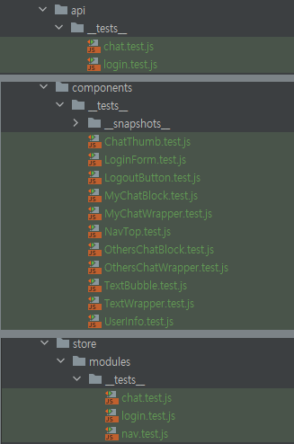
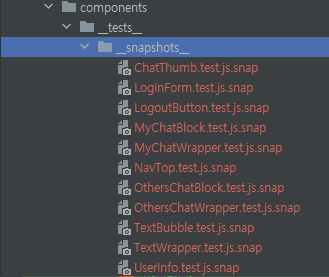
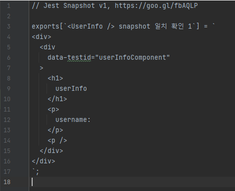
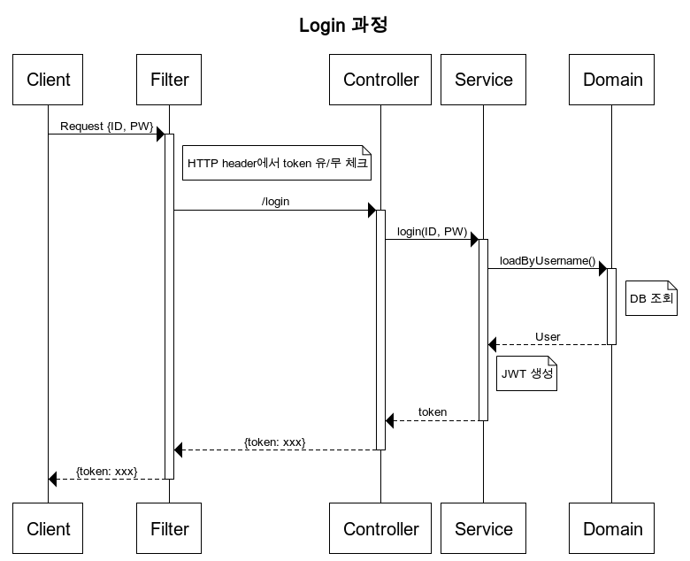
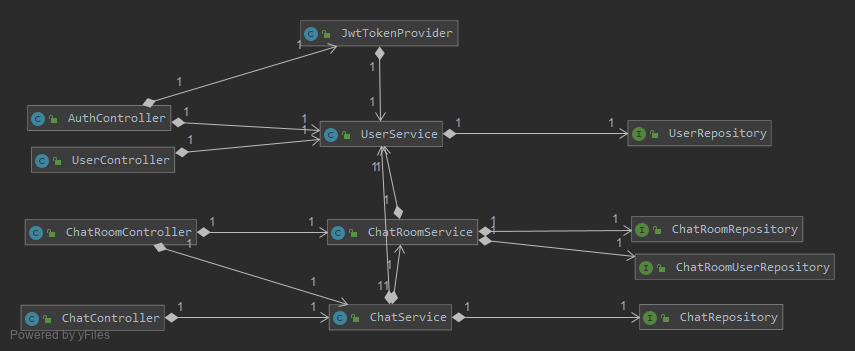

# mango-talk
## 프로젝트 소개
* 웹소켓 메신저

---
<br/><br/>

# 기술스택
## Front-end
* React
* Redux
* TypeScript
## Back-end
* Java 11
* Spring Boot 2.3.4
* Spring Data JPA
* Spring Security
* Spring REST DOCS
* MariaDB
## Test
### Front-end
* Testing-Library
* Jest

* 테스트를 위한 디렉토리 구조

* Snapshot


* 테스트 예시
1. Snapshot 및 props 데이터 전달 테스트 
```javascript
// snapshot & props data test
const userInfo = {
    username: "admin"
};

describe("<UserInfo />", () => {
    it("snapshot 일치 확인", () => {
        const utils = render(<UserInfo UserInfo={userInfo} />);
        expect(utils.container).toMatchSnapshot();
    });

    it("props 데이터 확인", () => {
        const utils = render(<UserInfo userInfo={userInfo} />);
        utils.getByText("admin");
    });
});
```
2. store action 테스트
```javascript
// store module test
describe('login', () => {
    describe('actions', () => {
        it('actions 생성', () => {
            const expectedActions = [
                {
                    type: 'login/LOGIN_SUCCESS',
                    payload: {}
                },
                {
                    type: 'login/INPUT_USERNAME',
                    payload: {}
                },
                {
                    type: 'login/INPUT_PASSWORD',
                    payload: {}
                },
                {
                    type: 'LOGOUT'
                },

            ];
            const actions = [
                chatActions.loginSuccess({}),
                chatActions.setUsername({}),
                chatActions.setPassword({}),
                chatActions.logout()
            ];
            expect(actions).toEqual(expectedActions);
        });
    });
});
```
3. API mocking을 이용한 비동기 API 통신 테스트
#### ChatListContainer - ChatList 컴포넌트 구조
```javascript
// ChatListContainer Component
async function getChats() {
    // @ts-ignore
    const token = arguments[0] ? arguments[0] : getCookie("token");
    const response = await Axios.get("http://localhost:8080/mango/v1/chatRoom", {
        headers: {
            "Authorization": `Bearer ${token}`
        }
    });
    return response.data;
}

function ChatListContainer({ token }: any) {
    // @ts-ignore
    const [state] = token ? useAsync(() => getChats(token), [token]) : useAsync(getChats, []);
    let { loading, data: list, error }: any = state;
    if (loading) return <div>로딩 중...</div>;
    if (error) return <div style={{color: "black"}}>채팅 목록을 불러오는 데 실패했습니다.</div>;
    if (!list) return null;
    return <ChatList list={list} />;
}

export default ChatListContainer;
```
```javascript
// ChatList Component
function ChatList({list}: any) {
    const keyList = Object.keys(list);
    const components: JSX.Element[] = [];

    keyList.map((roomNo: any, i: any) => {
        // const {username, ellipsis, lastReceivedDate} = list[roomNo];
        const username = list[roomNo].username || "";
        const ellipsis = list[roomNo].ellipsis || "";
        const lastReceivedDate = list[roomNo].lastReceivedDate || "";
        components.push(
            <Link key={`link-key-${i}`} to={`/chat/user/${roomNo}`}>
                <ChatThumb
                    key={`chatThumb-key-${i}`}
                    username={username}
                    ellipsis={ellipsis}
                    lastReceivedDate={lastReceivedDate}
                />
            </Link>
        )
    });
    return (
        <>
            <BrowserRouter>
               {components}
            </BrowserRouter>
        </>
    );
}

export default ChatList
```
```javascript
// test for chat.t.ts(API module)
describe('API', () => {
    describe("chat", () => {
        const mock = new MockAdapter(Axios, { delayResponse: 1500 });
        mock.onGet("http://localhost:8080/mango/v1/chatRoom", "", {
            Accept: "application/json, text/plain, */*",
            Authorization: "Bearer 1"
        })
            .reply(200,
                [{username: 'admin', ellipsis: 'xxx...', lastReceivedDate: '1111-11-11 11:11:11'}]);
        it('getChatRoomList API 응답 테스트', async () => {
            const { getByText } = render(<ChatListContainer token="1" />);
            await waitForElement(() => getByText('로딩 중...'));
            await wait();
            await waitForElement(() => getByText('admin'));
        });
    });
});
```
### Back-end
* Junit 5
* Jacoco - Code Coverage 측정

* 테스트 예시
``` java
@Test
@DisplayName("채팅 저장 성공")
void saveTest() {
    // given
    Long chatRoomId = testCreate();
    ChatDto.SaveRequest request = ChatDto.SaveRequest.builder().chatRoomId(chatRoomId).content("hello").build();

    // when
    Long chatId = chatService.save(request, username);

    //then
    Chat chat = chatService.findById(chatId);
    assertEquals(chatId, chat.getId());
}

@Test
@DisplayName("채팅, 없는 ID 조회")
void getWrongIDTest() {
    // given
    Long id = 2L;

    // when
    // then
    assertThrows(NotFoundException.class, () -> {
        chatService.findById(id);
    });
}

```

----
<br/><br/>

# 구현기능
## 로그인

## 인증


# Network


# Diagram
## Class Diagram

