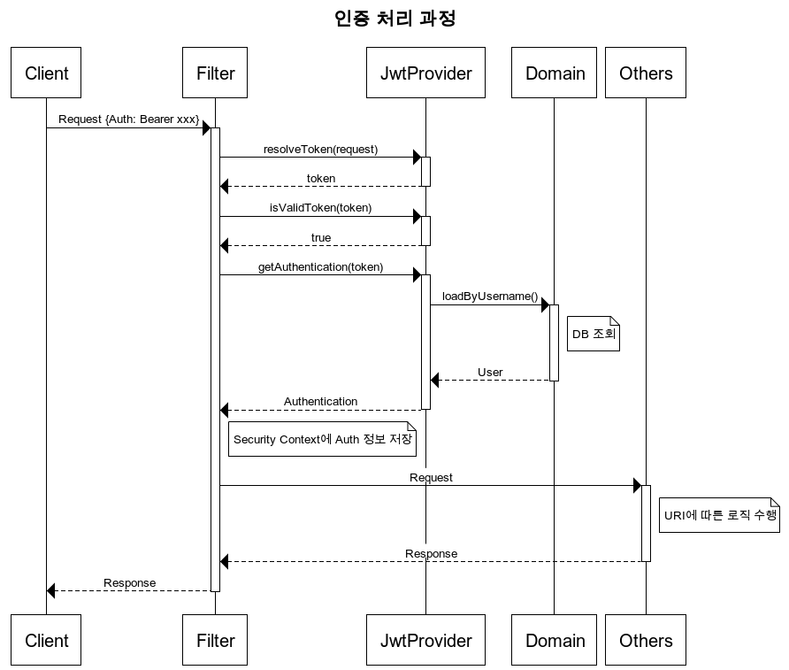

# mango-talk
## 프로젝트 소개
* 웹소켓 메신저

---
<br/><br/>

# 기술스택
## Front-end

## Back-end
* Java 11
* Spring Boot 2.3.4
* Spring Data JPA
* Spring Security
* Spring REST DOCS
* MariaDB
## Test
* Junit 5
* Jacoco - Code Coverage 측정

* 테스트 예시
``` java
@Test
@DisplayName("채팅 저장 성공")
void saveTest() {
    // given
    Long chatRoomId = testCreate();
    ChatDto.SaveRequest request = ChatDto.SaveRequest.builder().chatRoomId(chatRoomId).content("hello").build();

    // when
    Long chatId = chatService.save(request, username);

    //then
    Chat chat = chatService.findById(chatId);
    assertEquals(chatId, chat.getId());
}

@Test
@DisplayName("채팅, 없는 ID 조회")
void getWrongIDTest() {
    // given
    Long id = 2L;

    // when
    // then
    assertThrows(NotFoundException.class, () -> {
        chatService.findById(id);
    });
}

```

----
<br/><br/>

# 구현기능
## 로그인

## 인증



# Network
